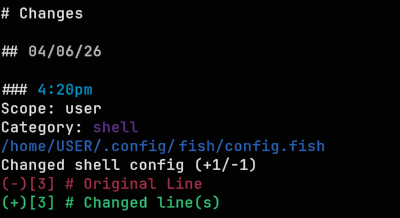

# changed

> This project is in Pre-Release, and is subject to changes or instability.

`changed` is a lightweight system tuning changelog for systemd-based Linux systems.

It keeps a readable history of config changes while a dedicated daemon is
running, with separate user and system scopes, line-numbered diffs for tracked
files, and systemd service integration for long-running use.

It helps to answer:

  - What did I change over time?
  - Which changes mattered for CPU, GPU, boot, services, shell, or build tuning?
  - What do I need to carry forward to a new install or new hardware?

Who it's for:

  - System tuners
  - Desktop tinkerers
  - People who frequently adjust shell, boot, service, CPU, GPU, or build config
  - Anyone who wants a readable changelog of config edits

It is not a backup, rollback, recovery, or snapshot tool.



## Current Release

The main feature set is in place today:

- user and system scoped tracking
- event-driven `changedd` daemon
- readable journal output with line-numbered changed-only diffs
- `changed setup` for first-run preset seeding
- `changed status` for operational diagnostics
- `changed service` for local/dev unit management
- diff and redaction controls per tracked path

Still planned:

- package event tracking
- service-state event tracking
- CLI config management and setup refinement

## Quick Start

### Installation

Arch-based distros:

```bash
yay -S changed
```

Or use your preferred AUR helper.

If you prefer to build it yourself:

```bash
git clone https://github.com/l3afyb0y/changed.git
cd changed
makepkg -si
```

Packaged installs ship both systemd unit files. After installing the
package, a normal first run looks like this:

```bash
sudo changed setup
systemctl --user enable --now changedd.service
sudo systemctl enable --now changedd.service
changed status -U
sudo changed status -S
```

`sudo changed setup` is the first required step for preset-backed tracking.
If `changed list` still shows no history on a fresh install, make sure setup
has been run and the daemon is enabled for the scope you expect.

If you only want private per-user tracking, start only the user service:

```bash
sudo changed setup
systemctl --user enable --now changedd.service
changed status
changed list
```

The default read behavior is user-scoped:

- `changed list` reads current-user history
- `changed status` reads current-user diagnostics
- `-SU` is the explicit merged read across system plus current-user scope

## Common Commands

```bash
changed list
changed list -U -a
changed list -P
sudo changed list -S -a
changed status -P
changed track -U ~/.config/fish/config.fish
sudo changed track -S /etc/makepkg.conf
changed diff -U enable ~/.config/fish/config.fish
changed redact -U enable ~/.config/fish/config.fish
changed history clear -U
sudo changed history clear -SU
```

For packaged installs, enable services with `systemctl` directly. For local or
non-packaged installs, `changed service install` can generate scoped unit files
that point at the current binary location.

## Development

With two binaries in the workspace, local cargo runs should be explicit:

```bash
cargo build
cargo run --bin changed -- --help
cargo run --bin changedd -- --help
```

Typical local flow:

```bash
cargo run --bin changed -- init -U
cargo run --bin changed -- init -S
sudo cargo run --bin changed -- setup
cargo run --bin changedd -- --user --once
sudo cargo run --bin changedd -- --system --once
```

## Documentation

- [Getting started](docs/getting-started.md)
- [Operations and behavior](docs/operations.md)
- [Default tracked paths](docs/default-tracked-paths.md)
- [Scope model](docs/scope-model.md)
- [Category definitions](docs/categories.md)
- [Packaging workflow](docs/packaging-workflow.md)
- [CLI help reference](docs/help-text.md)
- [Man page source](docs/changed.1.md)
- [Planned improvements](docs/planned-improvements.md)

## Packaging

This repo includes a local-source [PKGBUILD](PKGBUILD) plus packaged systemd
units under:

- [packaging/systemd/system/changedd.service](packaging/systemd/system/changedd.service)
- [packaging/systemd/user/changedd.service](packaging/systemd/user/changedd.service)

Packaged upgrades do not restart either scope automatically. Restart the scope
you use explicitly after reinstalling or upgrading:

```bash
systemctl --user restart changedd.service
sudo systemctl restart changedd.service
```
